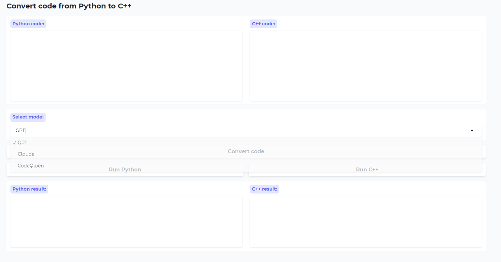

# Python-to-C++ AI Code Converter

---

## Overview

This project utilizes OpenAI and Anthropic Models as well as an open-source model to generate high-performance C++ code from Python code. It demonstrates how to set up and use a Hugging Face endpoint for code generation via an API. This serves as an introduction to deploying open-source models behind APIs, an essential step in integrating machine learning into production environments.
We also use Gradio for an interactive UI for the application.

## Features

- Translates Python code into optimized C++ code.
- Uses OpenAI, Anthropic, and Hugging Face models for code generation.
- Gradio-based UI for interactive code generation.
- Environment variable setup for API key management.

## Author

- **Pouria Ebrahimnezhad**

## Setup

Follow these steps to set up the project:

1. Clone the repository:
   ```bash
   git clone https://github.com/your-username/python-to-cpp-converter.git
   cd python-to-cpp-converter
   ```

2. Create a virtual environment (optional but recommended):
   ```bash
   python3 -m venv venv
   source venv/bin/activate  # On Windows, use venv\Scripts\activate
   ```

3. Install the necessary dependencies:
   ```bash
   pip install -r requirements.txt
   ```

4. Set up your environment variables by creating a `.env` file in the root directory. You will need to store your API keys for the various services (e.g., OpenAI, Anthropic, Hugging Face). Here is an example `.env` file:
   ```
   OPENAI_API_KEY=your_openai_api_key
   ANTHROPIC_API_KEY=your_anthropic_api_key
   HUGGINGFACE_API_KEY=your_huggingface_api_key
   ```

5. Once the setup is complete, you can run the application:
   ```bash
   python app.py
   ```

## Usage

1. Launch the app and navigate to the Gradio interface in your browser.
2. Input your Python code into the "Python code" textbox.
3. Select the model you want to use for conversion from the dropdown menu.
4. Click "Convert code" to generate the equivalent C++ code.
5. You can also run the Python or C++ code using the respective buttons for testing purposes.

## Example Code

Here's an example of how to convert Python code into C++:

- **Python code input:**
  ```python
  def hello_world():
      print("Hello, World!")
  ```

- **C++ code output:**
  ```cpp
  #include <iostream>
  using namespace std;

  void hello_world() {
      cout << "Hello, World!" << endl;
  }

  int main() {
      hello_world();
      return 0;
  }
  ```

## Output Example

Below is an example of the generated output from the Python-to-C++ converter:




## Requirements

To ensure the project runs smoothly, make sure to install all the required libraries using the `requirements.txt` file.

## `requirements.txt`

```
requests
dotenv
openai
google-generativeai
anthropic
gradio
IPython
```

---
